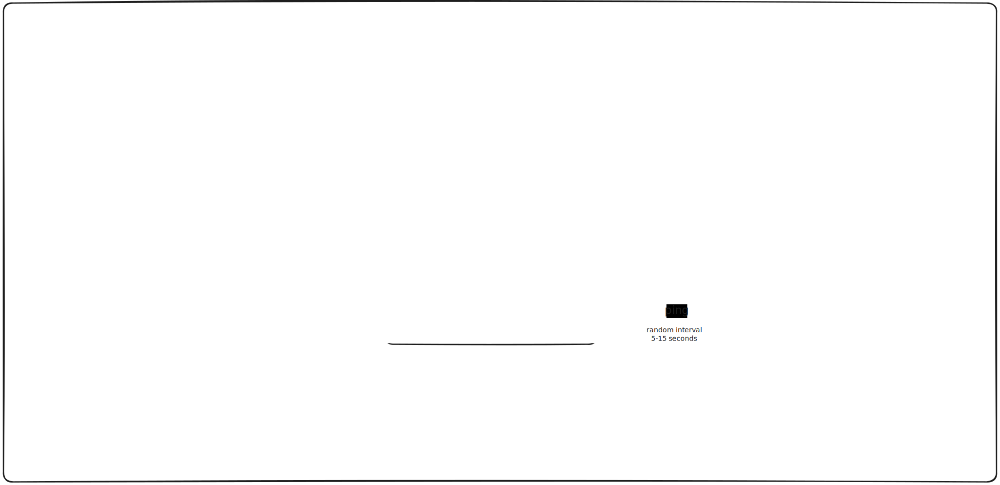

# Online indicator

## v1 requirements (✅ Done)

* Use redis for storing the userId to active session mapping
* Configure redis ttl for each entry which can be later
  observed for communicating the status

For a detailed overview, please refer to the [v1 documentation](docs/v1-docs.md).

## v0 requirements (✅ Done)

* Self-contained, in-memory server
* `POST /register` endpoint to add new account. It should accept `name` in the request body 
* `POST /login` endpoint to login and start new session. API request expects credentials (simply name for now), response should return a token for that session
* `POST /ping` endpoint to indicate being online. Request header should include session token acquired by logging in. 
* `GET /status/<name>` should return online status of single account.
* `GET /status/all` should return online status of all the accounts
* `POST /status/batch` should provide list of ids in the request body and API should response with their online status
* An HTTP client to simulate the user activity using public APIs
* A minimal web dashboard showing live status of 'n' users, powered by short-polling

For a detailed overview, please refer to the [v0 documentation](docs/v0-docs.md).

## Setup and Running Instructions

For detailed instructions on how to set up and run this project using Docker, please refer to the [Setup and Running Instructions](docs/setup.md) document.
