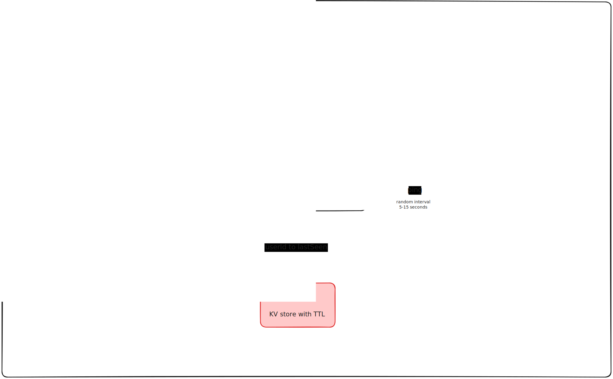

# Design Document v1

This release hasn't changed the architecture that much, rather it aims
to serve as a foundation for building realtime features ahead. Kindly refer
[v0 documentation](v1-docs.md) first to get a better understanding of the system

### redis

To facilitate the realtime status, we needed an observable DB
that has a way to notify key expiration and addition. We need
observability at the user level, so managing it using Kafka
and similar brokers with a topic per user model will be too
expensive to maintain

All we need is userId to lastSeen mapping, so naturally redis
check multiple boxes here:
* We can easily shard the data and scale redis cluster as the
  load grows
* Redis supports key expiration and ways to get notified about
  the expired key
* This is very short-lived data, so no disk persistence is required
* We are okay exposing this DB to edge servers as this is not 
  very sensitive data
* The data itself is in a key-value structure
